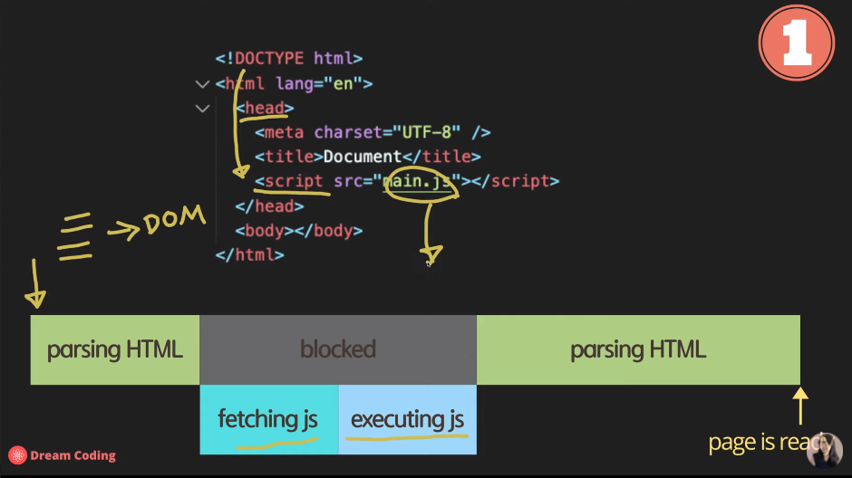
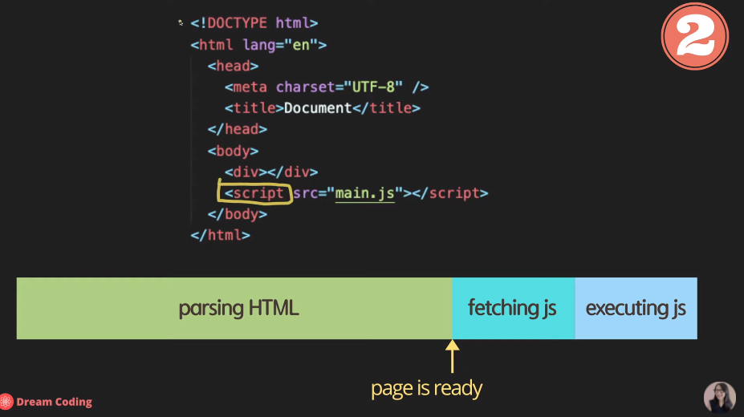
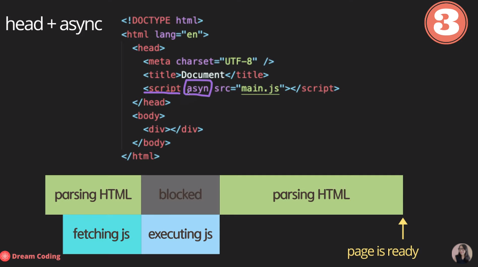
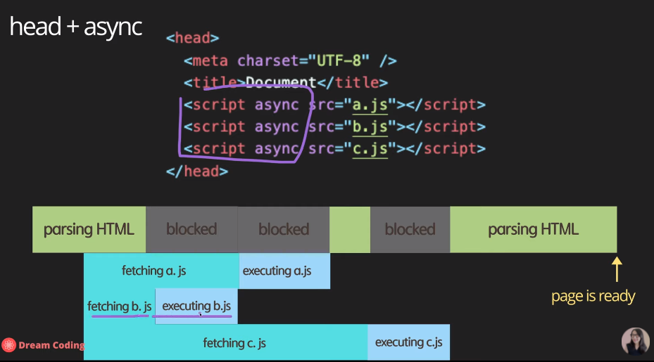
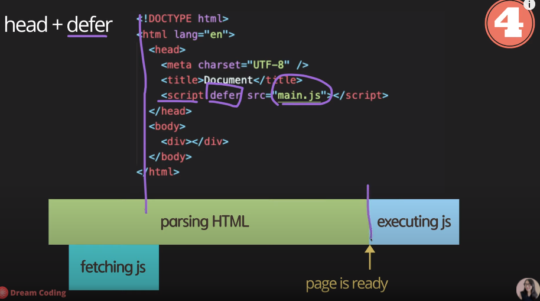

# JavaScript ES 5+(async, defer)

# parsing이란?

- 기본적으로 HTML문서는 parsing(컴퓨터가 코드를 분석하고 이해하는 과정)을 거쳐서 동작하는데, 여기서 javascript는 또한 parsing되며 실행된다.

# javascript parsing

## One

- HTML 중간에 script를 넣는 경우



### 문제점

- script 파일을 HTML 중간에 넣어 parsing하게되면 가장 큰 문제는 속도다. 기본적으로 script 파일을 parsing하게 되면
  해당 파일을 가져와(fetching js) 실행(executing js)하게 되는데 인터넷이 빠르거나 script 파일의 용량이 적다면 문제가 안되지만
  반대의 경우라면 사용자는 페이지의 구조(HTML/CSS)를 보기위해 한없이 기다려야한다.

## Two

- HTML 끝에 script를 넣는 경우



### 문제점

- 사용자가 페이지의 구조를 보기에는 큰 문제가 없겠지만 만약 페이지의 전체적인 구조를 보기위해 js가 빠지면 안되는 상황이라면
  script 부분이 상당히 느리게 나오기에 사용자는 역시 한없이 기달려야하는 상황이 나온다.

- 위의 문제들을 해결하기 위해 나온 문법이 async, defer이다.

## async

- async는 기본적으로 boolean으로 되어있고 true값을 반환하기에 해당 명령어에 포함하면 사용할 수 있다.



- HTML 문서를 parsing하다가 script를 만나게되면 파일을 가져오면(fetching)실행해주겠다는 약속을 하고 parsing을 멈추지 않고 계속 진행한다.
  가져오는 것이 끝나면 parsing을 잠시 멈추고 script를 실행하며 이후 다시 parsing을 진행한다.

### 문제점



- 한 개의 js파일을 parsing하는 거라면 큰 문제가 없지만 다수의 js파일을 parsing하게 되면 먼저 가져온 것을 먼저 실행하게 된다. 내가 짠 소스가
  순서에 상관이 없다면 사용해도 문제가 없으나 순서에 의존하는거라면 순서대로 실행되지 않기에 문제가 발생한다.

## defer

- 기본적으로 가장 좋은 옵션이다. (그렇다고 모든 상황에 좋다는 것은 아님. 상황에 맞춰 필요한 것을 사용하는 것이 개발자 덕목.)



- async와 상당히 유사하지만 js파일을 가져오더라도 parsing이 끝난 후에 실행시켜준다. 다수의 js파일을 실행시키더라도 parsing이 끝난 후에
  순서대로 실행시켜주기에 순서에 의존하는 소스에서도 큰 문제가 발생하지 않는다.

## +) Bonus

### 'use strict'

- ECMAScript5(ES5)에 추가되어 있어서 바로 사용할 수 있는 기능이며, 선언되지 않은 값의 사용을 방지할 수 있다.

```
// 'use strict' (X)
a = 3; //브라우저에서 에러가 발생하지 않는다.

// 'use strict' (O)
'use strict';
a = 3; //정의되지 않는 변수라는 에러가 발생(a is not defined)
```

- 이처럼 좀 더 효율적인 코딩을 가능하게 해준다.

> [참고영상:드림코딩By엘리](https://www.youtube.com/watch?v=tJieVCgGzhs)
